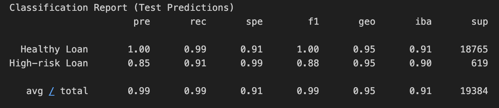
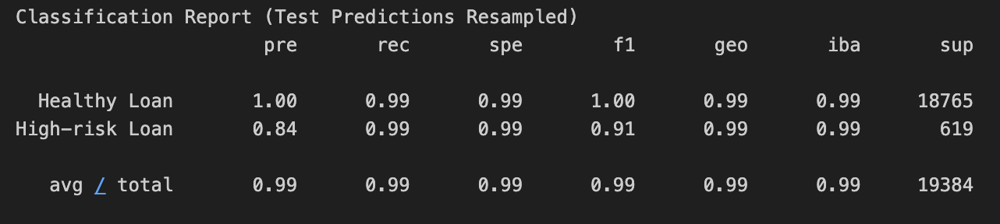

# Unit 12 - Credit Risk Classification

## Files

* [Analysis File](credit_risk_resampling_DK.ipynb)
* [Seed Data](/Resources/lending_data.csv)

## Overview of the Analysis

Credit risk poses a classification problem that’s inherently imbalanced. This is because healthy loans easily outnumber risky loans. I used various techniques to train and evaluate models with imbalanced classes. We start with a data file consisting of historical lending activity from a peer-to-peer lending services company to build a model that can identify the creditworthiness of borrowers.

First I created a Logistic Regression Model with the Original Data. 

When doing so, I noticed the small number of high-risk loan labels, which led to a low recall rate within the analysis.  Due to this, I chose to use a new model that uses resampled data in hopes it performs better.  Specifically, I used `RandomOverSampler`.

After resampling the data with an oversampling technique, I predicted with a Logistic Regression Model on the Resampled Training Data.

For both cases, I analyzed the count of the target classes, trained a logistic regression classifier, calculated the balanced accuracy score, generated a confusion matrix, and generated a classification report to look at precision, recall, specificity, and the f1 scores.

## Results Model 1

* Machine Learning Model 1:
  * Logistic Regression Model
  * Balanced Accuracy Score: 95.20%
  * Precision Healthy Loan: 1.00
  * Precision High-risk Loan: 0.85
  * Recall Healthy Loan: 0.99
  * Recall High-risk Loan: 0.91

## Results Model 2 (Oversampled Data)

* Machine Learning Model 2:
  * Logistic Regression Model
  * Balanced Accuracy Score: 99.37%
  * Precision Healthy Loan: 1.00
  * Precision High-risk Loan: 0.84
  * Recall Healthy Loan: 0.99
  * Recall High-risk Loan: 0.99

## Summary

Of the two models tested, the second model (Model 2 with the oversampled data) performed the best from an Accuracy (99.37%) and Recall (Model 2: 0.99/0.99 vs Model 1: 0.99/0.91) perspective.  It performed slightly under Model 1 from a precision of the High-risk Loan identification at a 0.84 (Model 2) vs 0.85 (Model 1).  Due to this, oversampling the data proved to be successful in enhancing the data predictions.

The performance of specific predicitons for False Positives and False Negatives does matter based on the industry/problem we are trying to solve.  In the instance of a bank, predicting a false positive for a healthy loan, when in reality it is a high-risk loan, damages the bank more than predicting a false positive of a high-risk loan when in reality it is a healthy loan.  The default likelihood of a high-risk loan is more impactful than the missed interest commission.  The potential outcomes we are concerned with: 
* False Negative (Identified as a Healthy Loan but in reality it is a High-risk Loan)
* True Negatives (High-risk Loan)

When looking at the models, the recall values for the High-risk Loan improved from 0.91 (Model 1) to 0.99 (Model 2).

As a bank, I would continue to research more models to improve the High-risk Loan precision, while not sacrificing any recall.  Out of these two models, I would recommend Model 2 and find it as a suitable use-case for the bank to approve loans due to the strong accuracy and recall.  
